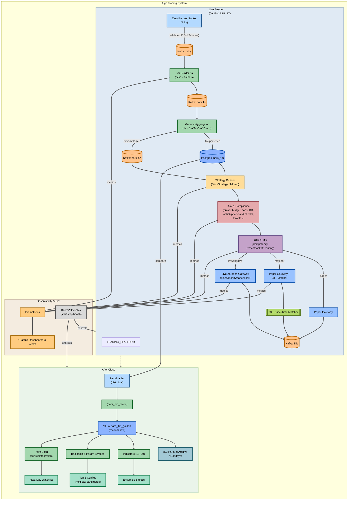

# Trading Platform

Algorithmic trading stack for ingesting live Zerodha ticks, aggregating to trading timeframes, running strategies, enforcing risk, and routing to paper or live execution. The platform also powers end-of-day reconciliation, research, and observability workflows.

## Table of Contents
- [System Overview](#system-overview)
- [Getting Started](#getting-started)
- [Runtime Workflows](#runtime-workflows)
- [Module Guide](#module-guide)
- [Scoring Engine](#scoring-engine)
- [Data & Storage](#data--storage)
- [Operations & Observability](#operations--observability)
- [Development Notes](#development-notes)
- [Additional Reading](#additional-reading)

## System Overview
The platform is organized around Kafka topics flowing between ingestion, compute, strategy, risk, and execution services. Postgres stores golden time series, live order state, and analytics backends.



## Getting Started
### Prerequisites
- Python 3.11+, `pip`, and `virtualenv`
- Docker Desktop (or Docker Engine) with Compose
- Git, make, and clang/cmake if you plan to compile the C++ matcher

### Environment setup
1. Create a virtualenv and install dependencies:
   ```bash
   python3 -m venv .venv
   source .venv/bin/activate
   pip install -r requirements.txt
   ```
2. Copy `.env.example` (if present) or author `.env` with secrets, then review `infra/.env` defaults. Both files are loaded by most components.
3. Optional: fill `ingestion/auth/token.json` via `make kite-exchange REQUEST_TOKEN=...` when enabling live Zerodha access.

### Local infrastructure
- `make up`: start Kafka, Zookeeper, Postgres, Prometheus, Grafana, Kafka UI, and exporters defined in `infra/docker-compose.yml`.
- `make ps`, `make logs`, `make down`, `make reset`: container management helpers.
- Kafka topics are created once via `infra/scripts/create-topics.sh`. Adjust replication/retention knobs in `infra/.env`.
- Postgres schema is bootstrapped from `infra/postgres/init/*.sql`.

### Running core services (example)
- Live tick feed: `make ws`
- Bar building pipeline: `make agg-multi`
- Strategy runner by timeframe: `make strat-1m` / `make strat-5m`
- Risk sizing: `make risk-v2`
- Paper execution loop: `make exec-paper-matcher`
- Switching to live Zerodha gateway:
  ```bash
  make budget-guard
  make zerodha-live-allowed
  make zerodha-poller
  ```

## Runtime Workflows
### Live session
1. **Ingestion** (`ingestion/zerodha_ws.py`) streams ticks into Kafka `ticks`.
2. **Compute** (`compute/bar_builder_1s.py`) normalizes to 1s bars and `compute/bar_aggregator_1m_to_multi.py` fans out to `bars.{tf}` topics and Postgres tables.
3. **Strategy runners** (`strategy/runner_modular.py`, `strategy/runner_unified.py`, ensembles, pair engines) consume new bars, emit signals, and persist orders.
4. **Risk & compliance** (`risk/manager_v2.py`, `risk/order_budget_guard.py`) resize orders, enforce budgets, and throttle flow before pushing to `orders.sized` / `orders.allowed`.
5. **Execution** (`execution/oms.py`, `execution/zerodha_gateway.py`, `execution/paper_gateway_matcher.py`) track order state, integrate with the C++ matcher, and publish fills.

### After close
- `orchestrator/eod_pipeline.py` drives reconciliation against Zerodha historical data, archives bars to S3 (see `compute/sinks/s3_archiver.py`), recalculates indicators, and snapshots top strategy candidates.
- Monitoring scripts (`monitoring/daily_recon_v2.py`, `monitoring/recon_autoheal.py`) validate data completeness and trigger alerts.

### Research & backtesting
- `backtest/engine.py` and `backtest/grid_runner_parallel.py` replay golden bars, scoring strategies with stored configs.
- `research/pairs_maker.py` and `analytics/pairs/find_pairs.py` surface candidate spreads for the live pairs engines.
- `ui/backtest_app.py` provides a Streamlit dashboard (`make bt-ui`) for inspecting results.

## Scoring Engine
- **Purpose**: Standardize how candidate strategy configurations are evaluated during grid searches and nightly ranking runs.
- **Location**: `backtest/scorer.py` exposes composable functions such as `apply_constraints`, `score_rows`, and `aggregate_by_config`.
- **Inputs**: Row-wise metrics including normalized return (`R`), Sharpe, Sortino, win rate, drawdown, turnover, average holding time, and optional penalties or timestamps.
- **Process**: Metrics are winsorized and z-scored per (strategy × timeframe) cohort to enable cross-symbol comparisons. Defaults enforce positive returns, drawdown thresholds, freshness decay, and configurable weights.
- **Outputs**: Adds `score` fields, rejection reasons, and helper selections (`select_topk_per_symbol_tf`, `decide_next_day`) that feed directly into `configs/next_day*.yaml`.
- **Customization**: Override `DEFAULT_GATES` and `DEFAULT_WEIGHTS` in caller code (`backtest/grid_runner_parallel.py`, `tools/promote_topn.py`) to favor bespoke objectives. See [docs/scoring.md](docs/scoring.md) for tuning guidance.

## Module Guide
Directory map with deeper dives:

| Domain | Description | Entry points | Notes |
| --- | --- | --- | --- |
| [Ingestion](docs/ingestion.md) | Tick, historical, and DLQ ingestion | `ingestion/zerodha_ws.py`, `ingestion/dlq_consumer.py` | Handles auth bootstrap, topic smoke tests |
| [Compute](docs/compute.md) | Bar aggregation and derived data | `compute/bar_builder_1s.py`, `compute/bar_aggregator_1m_to_multi.py` | Includes S3 archive sinks and sample producers |
| [Strategy](docs/strategy.md) | Signal engines and runners | `strategy/runner_modular.py`, `strategy/ensemble_engine.py` | Uses `configs/indicators.yaml`, `strategy/registry.yaml` |
| [Risk](docs/risk.md) | Order sizing, budgets, compliance | `risk/manager_v2.py`, `risk/order_budget_guard.py` | Integrates broker balances via `brokers/zerodha_account.py` |
| [Execution](docs/execution.md) | OMS, gateways, C++ matcher | `execution/oms.py`, `execution/zerodha_gateway.py`, `execution/cpp/matcher` | Supports dry-run, paper, and live modes |
| [Monitoring](docs/monitoring.md) | Health checks, exporters, doctor | `monitoring/doctor.py`, `monitoring/gateway_oms_exporter.py` | Exposes Prometheus metrics and Grafana dashboards |

Supporting domains:
- `accounting/`, `analytics/`, `ml/`: downstream ledgering, analytics, and model registry hooks.
- `configs/`: YAML configs for strategies, indicators, risk budgets, and tokens.
- `schemas/`: JSON Schemas validating Kafka payloads (`ticks`, `orders`, `fills`, `pair_signals`).
- `libs/`: shared primitives (signal types, kill switches, feature math).
- `tools/`: one-off utilities (`promote_topn.py`).

## Data & Storage
- **Kafka topics**: `ticks`, `bars.1s`, `bars.{1m,3m,5m,15m}`, `orders`, `orders.sized`, `orders.allowed`, `fills`, `pairs.signals`, and DLQs. Retention, partitions, and replication are configurable via `infra/.env`.
- **Postgres tables**: `bars_1m`, aggregated views (`bars_1m_golden`), `orders`, `live_orders`, `fills`, risk budgets, and backtest results. Schema migrations live under `infra/postgres/init`.
- **Object storage**: `compute/sinks/s3_archiver.py` writes parquet archives for >100-day retention (configure credentials through environment variables).

## Operations & Observability
- Prometheus scrapes exporters across modules (metrics ports annotated in code and Make targets).
- Grafana dashboards provisioned under `infra/grafana/dashboards`.
- `monitoring/doctor.py` provides an interactive CLI for starting/stopping key processes and verifying health.
- Exporters: Kafka lag (`kafka-exporter`), gateway lifecycle, risk drawdown, and pairs metrics (`monitoring/pairs_exporter.py`).
- Alerting hooks: configure Grafana alert rules or integrate with Slack/Webhooks through Grafana provisioning.

## Development Notes
- Use `make doctor` for a snapshot of process health and to tail important logs.
- Testing strategy runners/backtests: run `python backtest/engine.py --config configs/strategies.yaml --tf 1m`.
- C++ matcher: build with `make matcher-build` (depends on cmake/g++) before running `make matcher-run`.
- Keep configs under version control; runtime overrides go in `configs/*.runtime.yaml`.
- Follow JSON schema validation when emitting to Kafka; see `schemas/*.schema.json` and leverage `jsonschema` if needed.

## Additional Reading
- [docs/ingestion.md](docs/ingestion.md)
- [docs/compute.md](docs/compute.md)
- [docs/strategy.md](docs/strategy.md)
- [docs/risk.md](docs/risk.md)
- [docs/execution.md](docs/execution.md)
- [docs/monitoring.md](docs/monitoring.md)
- [docs/scoring.md](docs/scoring.md)
