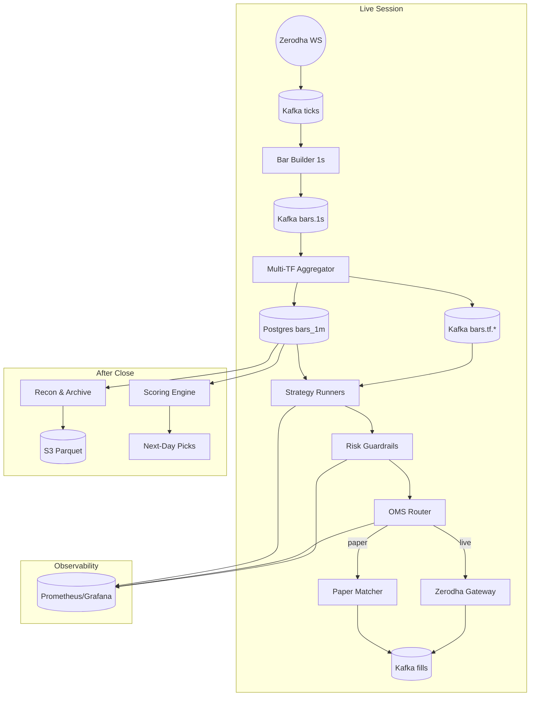

# Trading Platform

Event-driven stack for equities and derivatives: ingest Zerodha ticks, build golden bars, orchestrate strategies, enforce risk, and execute through paper or live gateways. The same core powers nightly reconciliation, research sweeps, and observability.

## Highlights
- Kafka-first streaming mesh with schema-validated ticks feeding modular Python services.
- Deterministic 1s→multi-timeframe bar pipeline backed by Postgres and Parquet retention.
- YAML-driven strategy registry, reusable indicator kit, and ranking engine for fast promotion cycles.
- Budget-aware risk layer with real-time throttles, Prometheus exporters, and runtime overrides.
- Execution adapters spanning paper matcher (C++ price-time engine) to Zerodha REST gateway with shadowing.

## System Map

## Quick Start
1. `python3 -m venv .venv && source .venv/bin/activate`
2. `pip install -r requirements.txt`
3. `make up` to launch Kafka, Postgres, Prometheus, Grafana, and Kafka UI.
4. Populate `.env` plus `infra/.env`; exchange Kite tokens via `make kite-exchange REQUEST_TOKEN=...` when trading live.

## Run the Core Loop
- Stream ticks: `make ws`
- Build bars + aggregates: `make agg-multi`
- Spin up strategies: `make strat-1m` / `make strat-5m`
- Risk + paper execution: `make risk-v2` then `make exec-paper-matcher`
- Flip to live Zerodha: `make zerodha-live-allowed` followed by `make zerodha-poller`

## Process Supervisor
- Launch coordinated stacks with `python orchestrator/process_supervisor.py` (prefers `.venv/bin/python`, loads `.env`/`infra/.env` automatically).
- Configure services in `configs/process_supervisor.yaml`; `{{python}}` expands to the resolved interpreter and `{{root}}` to the repo root.
- Set `stop_on_exit: false` on auxiliaries you do not want to bring the stack down; override per-service env vars under `env:`.
- Logs stream to `runs/logs/process_supervisor/stack_<timestamp>` by default; change `log_dir` in the config if needed.
- Ctrl+C or a failing service triggers graceful SIGTERM fan-out followed by SIGKILL after `shutdown_grace_seconds`.

## Architecture in Brief
| Stage | Focus | Entry Points |
| --- | --- | --- |
| Ingestion | Zerodha/WebSocket ticks, historical merges, DLQ tooling | `ingestion/zerodha_ws.py`, `ingestion/merge_hist_daily.py` |
| Compute | 1s→multi-TF bars, S3 archival, pair features | `compute/bar_builder_1s.py`, `compute/bar_aggregator_1m_to_multi.py` |
| Strategy | Modular runners, ensembles, pairs engines | `strategy/runner_modular.py`, `strategy/ensemble_engine.py` |
| Risk | Budget guardrails, spend tracking, exporters | `risk/manager_v2.py`, `risk/order_budget_guard.py` |
| Execution | OMS, C++ matcher, Zerodha gateway | `execution/oms.py`, `execution/paper_gateway_matcher.py`, `execution/zerodha_gateway.py` |
| Monitoring | Recon, doctor CLI, Grafana/Prometheus | `monitoring/doctor.py`, `monitoring/daily_recon_v2.py` |

## Research & Scoring
- Backtests + sweeps: `backtest/grid_runner_parallel.py`, `backtest/engine.py`
- Ranking engine: `backtest/scorer.py` (details in `docs/scoring.md`) for gating, z-scoring, and next-day promotion.
- Streamlit UI: `ui/backtest_app.py` (`make bt-ui`) to review strategy cohorts.

## Development Notes
- `make doctor` snapshots infra health and tails critical logs.
- C++ matcher builds with `make matcher-build` (clang/cmake required) before `make matcher-run`.
- Kafka payloads stay validated via `schemas/*.schema.json`; update schemas alongside producers.
- Keep `configs/*.yaml` versioned; runtime overrides land in `*.runtime.yaml`.

## Further Reading
- `docs/ingestion.md` • `docs/compute.md` • `docs/strategy.md` • `docs/risk.md` • `docs/execution.md` • `docs/monitoring.md` • `docs/scoring.md`
