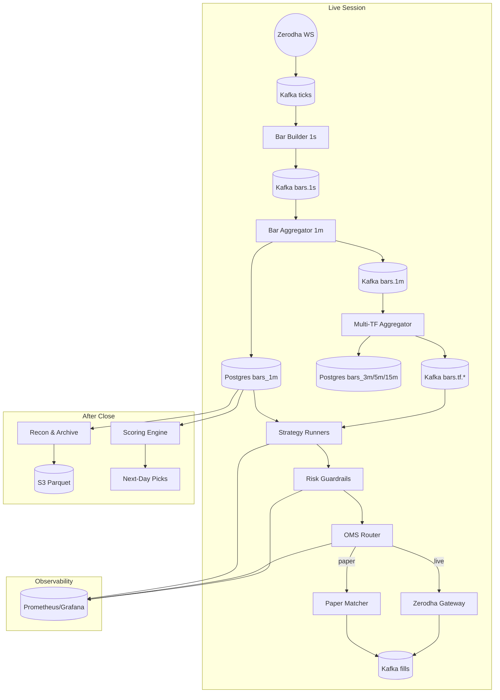
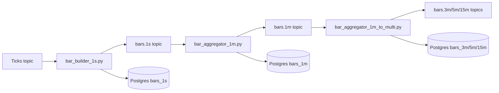
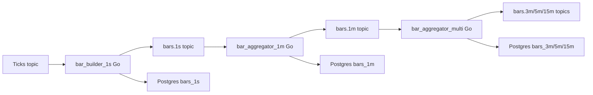
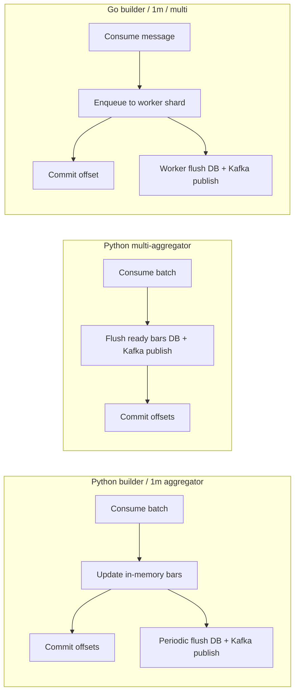

# Trading Platform

Event-driven stack for equities and derivatives: ingest Zerodha ticks, build golden bars, orchestrate strategies, enforce risk, and execute through paper or live gateways. The same core powers nightly reconciliation, research sweeps, and observability.

## Highlights
- Kafka-first streaming mesh with schema-validated ticks feeding modular Python services.
- Deterministic 1s→multi-timeframe bar pipeline backed by Postgres and Parquet retention.
- YAML-driven strategy registry, reusable indicator kit, and ranking engine for fast promotion cycles.
- Budget-aware risk layer with real-time throttles, Prometheus exporters, and runtime overrides.
- Execution adapters spanning paper matcher (C++ price-time engine) to Zerodha REST gateway with shadowing.

## System Map

## Quick Start
1. `python3 -m venv .venv && source .venv/bin/activate`
2. `pip install -r requirements.txt`
3. `make docker-config-list` (optional review) then `make up` to launch the full Docker unit (infra + app supervisor).
4. Populate `.env` for broker/app secrets. Docker infra values are single-sourced in `configs/docker_stack.json` and rendered to `infra/.env.docker` by `make up` / `make docker-config-sync`.
5. Exchange Kite tokens via `make kite-exchange REQUEST_TOKEN=...` when trading live.

## Run the Core Loop
- Default unit run: `make up` (starts `app-supervisor`, which runs `configs/process_supervisor.docker.yaml` inside Docker).
- Inspect unit status/logs: `make ps`, `make logs`, `make doctor`.
- Optional manual mode (host processes) remains available via existing `make ws`, `make agg-multi`, `make strat-1m`, etc.

## Process Supervisor
- Launch coordinated stacks with `python orchestrator/process_supervisor.py` (prefers `.venv/bin/python`, loads `.env`, `infra/.env.docker`, then `infra/.env` automatically).
- Configure services in `configs/process_supervisor.yaml`; `{{python}}` expands to the resolved interpreter and `{{root}}` to the repo root.
- Set `stop_on_exit: false` on auxiliaries you do not want to bring the stack down; override per-service env vars under `env:`.
- Logs stream to `runs/logs/process_supervisor/stack_<timestamp>` by default; change `log_dir` in the config if needed.
- Ctrl+C or a failing service triggers graceful SIGTERM fan-out followed by SIGKILL after `shutdown_grace_seconds`.

## Architecture in Brief
| Stage | Focus | Entry Points |
| --- | --- | --- |
| Ingestion | Zerodha/WebSocket ticks, historical merges, DLQ tooling | `ingestion/zerodha_ws.py`, `ingestion/merge_hist_daily.py` |
| Compute | 1s→multi-TF bars, S3 archival, pair features | `compute/bar_builder_1s.py`, `compute/bar_aggregator_1m_to_multi.py` |
| Strategy | Modular runners, ensembles, pairs engines | `strategy/runner_modular.py`, `strategy/ensemble_engine.py` |
| Risk | Budget guardrails, spend tracking, exporters | `risk/manager_v2.py`, `risk/order_budget_guard.py` |
| Execution | OMS, C++ matcher, Zerodha gateway | `execution/oms.py`, `execution/paper_gateway_matcher.py`, `execution/zerodha_gateway.py` |
| Monitoring | Recon, doctor CLI, Grafana/Prometheus | `monitoring/doctor.py`, `monitoring/daily_recon.py` |

## Research & Scoring
- Backtests + sweeps: `backtest/grid_runner_parallel.py`, `backtest/engine.py`
- Ranking engine: `backtest/scorer.py` (details in `docs/scoring.md`) for gating, z-scoring, and next-day promotion.
- Streamlit UI: `ui/backtest_app.py` (`make bt-ui`) to review strategy cohorts.
## Grafana Dashboard Sample
.png>)
## Development Notes
- `make doctor` snapshots infra health and tails critical logs.
- Docker stack config is single-sourced via `configs/docker_stack.json`; use `make docker-config-list` and `make docker-config-sync`.
- Prometheus app target host is also controlled from `configs/docker_stack.json` via `APP_METRICS_HOST`.
- `make metrics-sync` regenerates both Prometheus targets and the canonical Grafana observability dashboard.
- Manual Python vs Go varied-load benchmark with report: `make perf-test` (outputs in `runs/perf_compare/`).
- `make perf-test` defaults to `PERF_SCENARIO=paper-flow` (full paper path: ingestion, compute, pair-watch, execution, risk, matcher) and auto-starts required infra services without `app-supervisor`.
- To run ingest+agg-only mode instead: `make perf-test PERF_SCENARIO=pipeline`.
- Perf benchmark knobs: `LOADS`, `STAGE_SEC`, `WARMUP_SEC`, `SAMPLE_SEC`, `SIM_BASE_TPS`, `SIM_HOT_TPS`, `SIM_HOT_SYMBOL_PCT`, `SIM_HOT_ROTATE_SEC`, `SIM_STEP_MS`, `GO_PRODUCE_WORKERS`, `GO_PRODUCE_QUEUE`, `GO_MAX_BATCH`, `GO_BATCH_FLUSH_MS`, `GO_BAR1S_WORKERS`, `GO_BAR1S_QUEUE`, `GO_BAR1S_FLUSH_MS`, `GO_BAR1M_WORKERS`, `GO_BAR1M_QUEUE`, `GO_BAR1M_FLUSH_MS`, `GO_BARAGG_WORKERS`, `GO_BARAGG_QUEUE`, `GO_BARAGG_FLUSH_MS`, `PAIR_TF`, `PAIR_LOOKBACK`, `PAIR_COUNT`, `PAIR_MIN_READY`.
- `make go-build` runs through compose profile `tools` service `go-builder` and produces Linux artifacts for Docker-run Go benchmarks.
- C++ matcher builds with `make matcher-build` (clang/cmake required) before `make matcher-run`.
- Kafka payloads stay validated via `schemas/*.schema.json`; update schemas alongside producers.
- Keep `configs/*.yaml` versioned; runtime overrides land in `*.runtime.yaml`.
- Metrics endpoints are registry-driven via `configs/metrics_endpoints.json`; use `make metrics-list` and `make metrics-sync`.

## Further Reading
- `docs/ingestion.md` • `docs/compute.md` • `docs/strategy.md` • `docs/risk.md` • `docs/execution.md` • `docs/monitoring.md` • `docs/scoring.md`
- `docs/study_cheatsheet.md` • `docs/study_playbook.md` • `docs/study_plan_21d.md` • `docs/runbook_dry_mode.md` • `docs/architecture_tech_choices.md` • `docs/repo_file_catalog.md` • `docs/critical_file_deep_notes.md`
- `docs/metrics_endpoints.md`

## Current Python vs Go Architecture Differences (as of Feb 14, 2026)
- Scope: benchmark topology is now aligned for apples-to-apples comparison (`1s -> 1m -> multi` for both runtimes). Python remains the production baseline across all modules.
- Pipeline shape in benchmark mode:
  - Python: `ws-sim -> bar_builder_1s.py -> bar_aggregator_1m.py -> bar_aggregator_1m_to_multi.py`
  - Go: `ws_bridge -> bar_builder_1s (Go) -> bar_aggregator_1m (Go) -> bar_aggregator_multi (Go)`
- Python execution flow (benchmark path):

- Go execution flow (benchmark path):

- Offset/commit checkpoints (current behavior):

- Concurrency model:
  - Python compute path is asyncio-driven with batch polling and periodic flush.
  - Go path is worker-sharded (goroutines + per-symbol hashing) with per-worker queues and batched DB/Kafka writes.
- Offset/ack semantics today:
  - Python `bar_builder_1s.py` and `bar_aggregator_1m.py` commit per poll cycle after in-memory processing.
  - Python `bar_aggregator_1m_to_multi.py` commits offsets after successful flush.
  - Go builder/aggregator currently commit after enqueue to worker (higher throughput, weaker crash durability than flush-ack).
- Write path:
  - Python mostly uses `executemany` + per-message `send_and_wait`.
  - Go uses `pgx.Batch` + Kafka `ProduceBatch`.
- Tuning controls:
  - Ingestion: `GO_PRODUCE_*`
  - 1s builder: `GO_BAR1S_*`
  - 1m aggregator: `GO_BAR1M_*`
  - Multi-agg: `GO_BARAGG_*`
