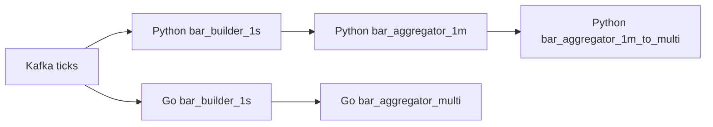

# Study + Run Playbook (Current Flow, Python Baseline + Go Hot Path)

This is the fastest way to understand the repository end-to-end, run it safely, and explain why each part is designed the way it is.

Use this with:
- `docs/study_cheatsheet.md`
- `README.md`
- `docs/study_plan_21d.md`
- `docs/runbook_dry_mode.md`
- `docs/architecture_tech_choices.md`

## 1) Current Flow Snapshot (as of Feb 14, 2026)

- Python is still the full baseline across ingestion/compute/strategy/risk/execution.
- Go currently targets the high-throughput ingestion + aggregation hot path and keeps contracts compatible.
- Benchmark compare path runs Python and Go stages side by side and writes a report in `runs/perf_compare/`.

### Full paper-flow path (what the product demonstrates)

```mermaid
flowchart LR
    SRC["Ingestion source ws or sim"] --> T["Kafka ticks"];
    T --> B1["bar_builder_1s py or go"];
    B1 --> K1["Kafka bars_1s"];
    B1 --> DB1["Postgres bars_1s"];
    K1 --> A1["bar_aggregator_1m python"];
    A1 --> K2["Kafka bars_1m"];
    K2 --> AM["bar_aggregator_multi py or go"];
    AM --> K3["Kafka bars_3m_5m_15m"];
    AM --> DB2["Postgres bars_3m_5m_15m"];
    K3 --> PW["pair_watch_producer"];
    PW --> SIG["Kafka pair_signals"];
    SIG --> EX["pairs_executor"];
    EX --> O["Kafka orders"];
    O --> R["risk_manager and budget_guard"];
    R --> OA["Kafka orders_allowed"];
    OA --> PM["paper_gateway_matcher"];
    PM --> F["Kafka fills"];
```



### Compute benchmark compare path (Python vs Go core)



## 2) Command Playbook (What to Run, In Order)

### Step A - Bootstrap once

```bash
python3 -m venv .venv
source .venv/bin/activate
pip install -r requirements.txt
```

Why this is written this way:
- The repo is Python-first for orchestration and most services.
- A local venv keeps dependency versions stable and avoids system Python conflicts.
- Even when testing Go services, support scripts (`tools/*.py`) still run from Python.

### Step B - Start the full Docker unit

```bash
make up
make doctor
```

Why this is written this way:
- `make up` is the single source entrypoint for infra + supervised app setup.
- The stack is config-driven (`configs/docker_stack.json` + generated env), not manual edits.
- `make doctor` gives a fast health signal before deeper debugging.

### Step C - Confirm what is running

```bash
make ps
make logs
make metrics-list
```

Why this is written this way:
- You first verify process liveness, then logs, then metrics endpoint contract.
- This matches production incident order: alive -> behaving -> measurable.
- It avoids guessing which exporter/port belongs to which service.

### Step D - Run realistic full paper-flow compare (Python then Go)

```bash
PERF_SCENARIO=paper-flow \
LOADS=500 \
STAGE_SEC=180 \
WARMUP_SEC=20 \
SAMPLE_SEC=5 \
make perf-test
```

Why this is written this way:
- Paper-flow runs compute + pair-watch + execution + risk + matcher together.
- It exercises near-live concurrency without broker-side live orders.
- The same harness runs Python and Go stages with comparable reporting.

### Step E - Run ingest+compute-only compare (hot path focus)

```bash
PERF_SCENARIO=pipeline \
LOADS=500 \
STAGE_SEC=180 \
WARMUP_SEC=20 \
SAMPLE_SEC=5 \
GO_PRODUCE_WORKERS=24 \
GO_PRODUCE_QUEUE=30000 \
GO_MAX_BATCH=2048 \
GO_BATCH_FLUSH_MS=10 \
GO_BAR1S_WORKERS=16 \
GO_BAR1S_QUEUE=16000 \
GO_BAR1S_FLUSH_MS=250 \
GO_BARAGG_WORKERS=16 \
GO_BARAGG_QUEUE=16000 \
GO_BARAGG_FLUSH_MS=500 \
make perf-test
```

Why this is written this way:
- Pipeline mode isolates ingestion + bars so bottlenecks are easier to locate.
- Go knobs expose worker/batch/backpressure control for repeatable tuning.
- You can push throughput while preserving existing Kafka/topic/table contracts.

### Step F - Build and run Go binaries directly (swappable modules)

```bash
make go-build
INGEST_CMD=./go/bin/ws_bridge make ingest-go
BARS1S_CMD=./go/bin/bar_builder_1s make bars1s-go
BARAGG_CMD=./go/bin/bar_aggregator_multi make baragg-go
```

Why this is written this way:
- Build happens in Docker for reproducible toolchain and target arch.
- Swappable command variables keep architecture stable while replacing implementation.
- This supports incremental migration instead of big-bang rewrites.

### Step G - Inspect benchmark output

```bash
ls -1t runs/perf_compare | head -1
```

Then open:
- `runs/perf_compare/<latest>/report.md`
- `runs/perf_compare/<latest>/report.json`

Why this is written this way:
- Markdown report is presentation-friendly; JSON is automation-friendly.
- Both preserve run metadata (load, timing, knobs) for fair comparisons.
- This is your interview evidence for perf and observability claims.

### Step H - Shutdown cleanly

```bash
make down
```

Why this is written this way:
- Clean stop avoids stale topics, lingering ports, and misleading next-run metrics.
- Controlled teardown mirrors controlled startup and improves reproducibility.
- It reduces false failures in subsequent perf runs.

## 3) Simple "Why It Is Written Like This" by Stage

### Ingestion
- It separates source handling from publish path to absorb bursty tick input.
- Backpressure and queue depth metrics are explicit to prevent silent drops.
- Go implementation adds worker-sharded batched Kafka writes for high symbol counts.

### 1s Bar Builder
- 1-second bars are the canonical normalization point for noisy ticks.
- Upsert + grace-window design handles minor out-of-order/late tick behavior.
- Go version shards by symbol so updates remain ordered per symbol while scaling out.

### Multi-Timeframe Aggregation
- Higher TF bars are derived from lower TF bars to keep one truth path.
- This reduces duplicated logic and makes recon/debug easier.
- Batched DB and Kafka writes trade small latency for much higher throughput stability.

### Strategy + Risk + Execution
- Strategy emits intent, risk enforces constraints, execution applies routing/state.
- Layering keeps mistakes isolated: alpha logic cannot bypass controls.
- Paper matcher provides deterministic fills for safe load and latency testing.

### Observability
- Prometheus metrics are service-native and scraped through a single registry.
- Grafana dashboards are generated/provisioned from repo files for consistency.
- Perf harness and dashboards are intentionally coupled for demo and diagnosis.

## 4) Study Flow (Fast, Then Deep)

### Pass 1 (60-90 min): map the system
1. Run Step B + Step C.
2. Read `README.md` and this playbook top-to-bottom.
3. Explain aloud: `ticks -> bars -> signals -> orders -> fills`.

### Pass 2 (2-4 hours): run and observe
1. Run Step D once.
2. Keep Grafana open during run (`http://localhost:3000`).
3. Read generated `report.md` and correlate key metrics with charts/logs.

### Pass 3 (interview prep): defend design choices
1. Run Step E with one different knob set.
2. Compare two reports and explain tradeoffs (throughput, p95, drops, queue).
3. Use `docs/architecture_tech_choices.md` to name at least one alternative per stage.

## 5) Interview Answer Template (Use Repeatedly)

For any service/file, answer in this order:
1. What does it consume?
2. What does it produce?
3. Why was it designed this way (3 lines)?
4. What alternative exists and why was it not chosen now?
5. How is it monitored and how would you detect failure?
